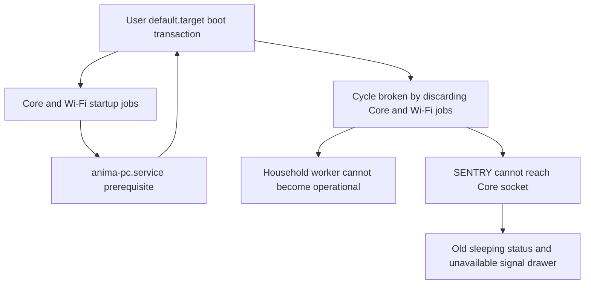
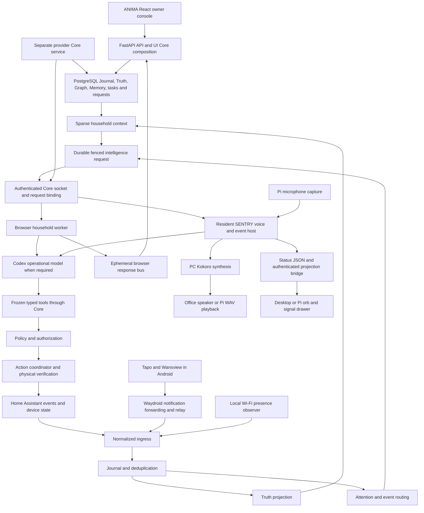
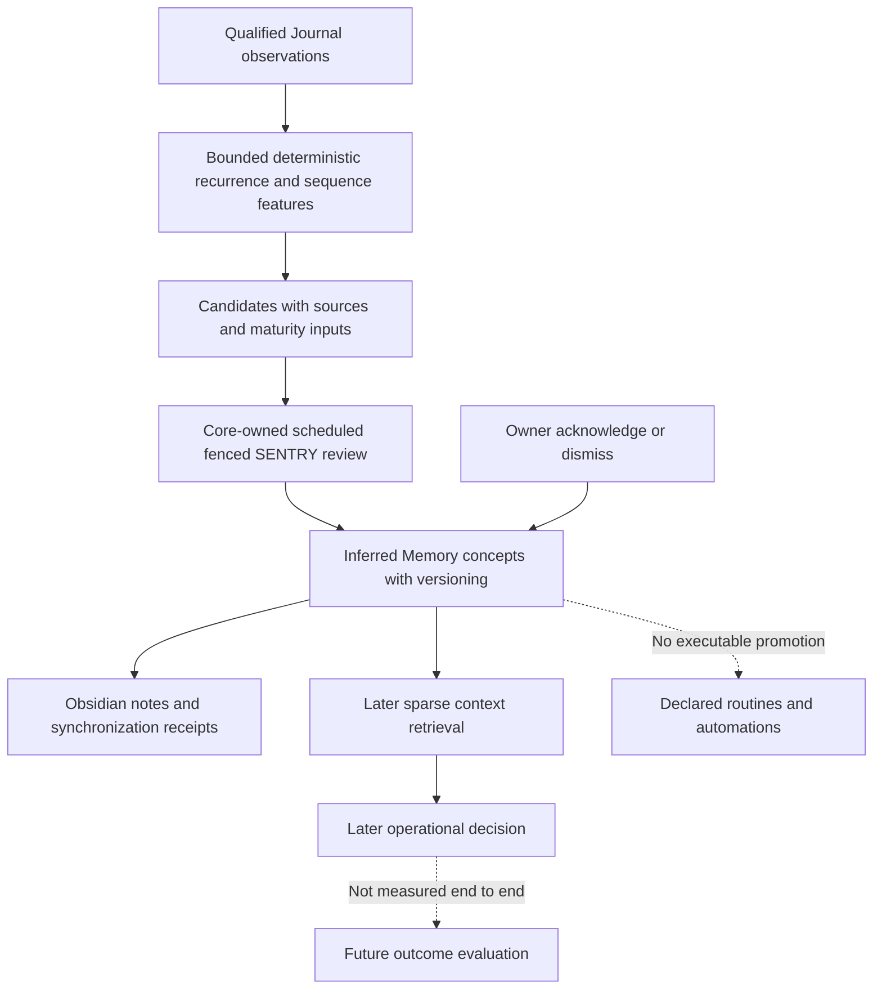
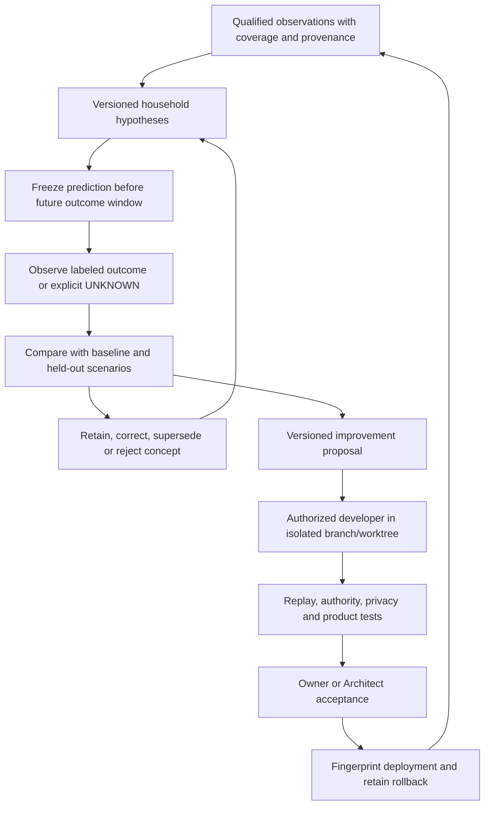

# ANIMA HA and SENTRY System Assessment

This report is for the owner and AI Architect. It assesses the implemented system, the current Linux deployment, the observed restart failure, and what is missing from a measurable household improvement loop. Five read-only agents assessed learning, integrations, operational reasoning, architecture and owner interfaces, and evaluation harnesses. The parent independently traced the restart failure and reconciled selected runtime files, database aggregates, GitHub and Notion.

The principal conclusion is that ANIMA/SENTRY has substantial event, authority, memory and review infrastructure, but the current deployment is not operational end to end. Household learning has produced revisable records and later retrieval, not demonstrated predictive improvement or useful automatic routine outcomes. A reliable improvement loop requires delivery continuity and outcome measurement before more learning machinery.

Assessment date: October 1, 2026, America/New_York. Metadata observations span approximately 23:51 UTC October 1 through the report's preparation. Product source, infrastructure, household configuration and services were not changed. No live model turns, physical actions, production writes, commits, pushes or deployments were performed. This report and the Authority snapshot/history are the only new project records.

## Verdict

`PARTIAL` for whole-system operational qualification; assessment completed within the read-only boundary. The current runtime is impaired. `ANIMA_HA_PROTOTYPE_GOAL_COMPLETE` is not established.

## Retrieval confidence

`ADEQUATE` for the inspected source, current service outage, selected file fingerprints and bounded database aggregates. `UNCERTAIN` for authenticated owner journeys, effective resident host permissions, current physical delivery and prediction usefulness. This was not an exhaustive verification of every endpoint, device, policy branch or source file.

## Source and deployment boundaries

| Boundary | Observed state |
| --- | --- |
| Local ANIMA | `main`, `c8ea05efe8c5a6ae5def4a1c75834910aa519d44` |
| Published ANIMA main | GitHub API returned `814e21a698d4107cc92c286fb5877d63670f1311`; the local product commit is unpushed |
| Local SENTRY | `feature/v0.4-personal-continuity`, `e2ab3b75781ec293f8830d910cb7622f34bd82cb`; one local commit above its recorded remote-tracking ref |
| Running ANIMA UI image ID | `sha256:44f8bf6baf75c7ae465799a267def4140a76234f390d76c26cc3b02aa570cc35` |
| UI container start | `2026-09-30T21:05:40.537711087Z` |
| Current host boot | September 30, 2026, 10:26:31 EDT, equivalent to 14:26:31 UTC |
| Canonical SENTRY setting | One household voice-settings row: `sleep_enabled=false`, `active_instance_id=office` |
| Canonical Notion authority | [ANIMA HA specification](https://app.notion.com/p/3c9833cb27ff81759597cdc69c59176c); retrieved page reports last edit `2026-09-23T01:05:42.212Z` |
| Existing architecture reference | [Code-derived architecture reference](https://app.notion.com/p/3e9833cb27ff8161a0eaf4bdc03dd38e); documentation, not a deployment-health certificate |

Selected container fingerprints show mixed deployment correspondence. An image tag, health response or matching API file cannot certify the entire build.

| Source file | Local SHA-256 | Deployed SHA-256 | Comparison |
| --- | --- | --- | --- |
| `sentry_sensor_status.py` | `1f86ac4fd2ba8eb7adf96c91e6f8161280b8a185566dd78a65232e0072830157` | Same | MATCH |
| `ui_api.py` | `a68a64063532992403f71ed85a11af1b7d93dd714a65ea3eeff37c7ace5e1675` | Same | MATCH |
| `household_learning.py` | `14da15129b318b595723b735f70ae0029b39e2fcdf4f594a99fe3ff6289cbf74` | `ed3e4896bdcb4b482629289c0f7a8c93a268c4ca79cdff119e9230d5bd55f715` | DIFFERENT |
| `learning_review_runner.py` | `480087986aa18b8bfdbc7974ffde03ef95c22c4248a477809753eb159364570a` | `b75da1bf4647c8f1f950dd608e329d16c79d31c55b3dbe588e8311b91223e739` | DIFFERENT |
| `ui_runtime.py` | `e45b4052879fba4e9d939360023b71b4911a85b931062fd1b86b787d3a580acb` | `95f94f943c9001812e1a62cf2f7918150de89c73d416054b2754f1ac44734471` | DIFFERENT |
| `sentry_service.py` | `1adf48c35386253c62b6e38ba81f9a34b09bfe2bb566d46748fedbb501e3d094` | `cd7d61787e5f99f382a9fd75bf544ea3dedb52a3448f61a85e65935fdf2a546e` | DIFFERENT |

These are selected file checks, not a fingerprint of all deployed bytes. Core is stopped, so its current executable behavior cannot be qualified. Tests against local learning source do not certify the older modules inside the running UI container.

The current Notion continuation is 027A-R5F. It supersedes earlier claims that only physical evidence remained. It retains both owner-approved wake aliases, `Sentry` and `century`, and historical owner-confirmed reboot PASS. The new September 30 boot failure is a regression; it does not erase earlier evidence. The local Authority snapshot was still headed by September 10 R5D records before this assessment.

## Technical state discovered

### Restart failure

The boot journal records the causal startup failure at September 30, 10:26:43 EDT:

```text
default.target: Found ordering cycle on anima-wifi-presence.service/start
default.target: Found dependency on anima-pc.service/start
default.target: Found dependency on default.target/start
default.target: Job anima-wifi-presence.service/start deleted to break ordering cycle
default.target: Found ordering cycle on anima-core.service/start
default.target: Job anima-core.service/start deleted to break ordering cycle
```

The installed [anima-pc.service](/home/sketch/.config/systemd/user/anima-pc.service:3) orders itself after `default.target` while also being wanted by that target. The tracked [Core unit](</home/sketch/Projects/ANIMA Home Automation/deploy/systemd/user/anima-core.service:3>) and [Wi-Fi unit](</home/sketch/Projects/ANIMA Home Automation/deploy/systemd/user/anima-wifi-presence.service:3>) require/order after that stack. The [household worker](</home/sketch/Projects/ANIMA Home Automation/deploy/systemd/user/anima-household-worker.service:3>) also depends on Core. The observed transaction contained a cycle and discarded startup jobs. The installed stack unit is not one of the repository's tracked deployment units.



| Runtime component | Observed state | What it does not prove |
| --- | --- | --- |
| ANIMA UI, PostgreSQL, OPA, SearXNG containers | Running and healthy | Core/provider, learning and voice readiness |
| Home Assistant container | Running; HTTP probe returned 200 | Every commissioned device's current state |
| `anima-pc.service` | Active, exited | Its dependent start jobs ran |
| `anima-core.service` | Enabled, inactive | No live Core socket service was observed |
| `anima-household-worker.service` | Enabled, inactive | No active browser request consumption |
| `anima-wifi-presence.service` | Enabled, inactive | No current phone observation |
| `sentry-voice.service` | Inactive | No current wake/listen/speech qualification |
| `sentry-voice-supervisor.service` | Running; repeated `AnimaHouseholdError` every five seconds | Successful recovery or voice availability |
| Android container | System service active | Android framework finished booting |
| Android session unit | Inactive | Supervisor's session label alone is insufficient |
| Android readiness document | Fresh `NOT_READY`, `boot_completed=false` | Vendor push readiness |
| Android forwarding/listener | `WAYDROID_BINDER_SERVICE_MANAGER_UNAVAILABLE` / `WAYDROID_FORWARDER_NOT_READY` | Notification transport availability |
| FCM, network and vendor readiness | `UNKNOWN` or `NOT_READY`, reason `ANDROID_NOT_BOOTED` | Current Tapo/Wansview authentication or receipt |
| Vendor relay | Running; fresh `READY` heartbeat, current-process received/accepted/failed counters all zero | Android attachment or successful vendor delivery |

The authenticated sensor helper was executed without changing state. It returned `status=UNAVAILABLE`, zero items and the bounded unavailable reason. This is a connection failure, not evidence that sensor registrations were deleted. The drawer ignores that distinction and renders “No registered signals are available.” See [read_sensor_status](/home/sketch/Projects/SENTRY/tools/sentry_ui.py:532) and [drawer rendering](/home/sketch/Projects/SENTRY/tools/sentry_ui.py:2081).

The voice file still reports `SLEEPING`, `sleep_enabled=true`, updated `2026-09-30T14:46:21.302466+00:00`, despite the current database setting being awake/office. Both [desktop status reading](/home/sketch/Projects/SENTRY/tools/sentry_ui.py:521) and [projection status reading](/home/sketch/Projects/SENTRY/tools/sentry_projection_status.py:31) accept retained status without checking freshness. The [supervisor](/home/sketch/Projects/SENTRY/tools/sentry_voice_supervisor.py:93) needs Core to reconcile desired state; caught errors only produce retry diagnostics. It does not repair the missing Core startup dependency.

Read-only request aggregates: 133 PENDING, 677 COMPLETED, 275 NO_ACTION, 129 FAILED, 89 CANCELLED, 33 RECOVERY_REQUIRED and 13 UNKNOWN_RESULT. There were zero active CLAIMED/DELIVERED_TO_PROVIDER/PROVIDER_RUNNING rows; 46 provider-started ambiguous/recovery records were retained. Twenty-nine requests created since the observed host boot were still PENDING, with no other lifecycle represented among that post-boot cohort. None were reset or replayed. These counts are not a permission to reclaim started work.

### System ownership and dataflow

ANIMA is the authority and management plane. SENTRY is the voice/provider interaction layer. Two ANIMA processes compose Core facilities over common PostgreSQL stores: the UI process and the separate provider Core service. They are not one inseparable application. Docker UI health can coexist with a stopped provider Core and resident SENTRY.



The arrows describe inspected implementation connections, not current health or a guarantee that all edges execute. Key entrypoints are [UI mounting](</home/sketch/Projects/ANIMA Home Automation/ui/src/main.tsx:319>), [API composition](</home/sketch/Projects/ANIMA Home Automation/src/anima_ha/ui_api.py:2821>), [Core/plugin composition](</home/sketch/Projects/ANIMA Home Automation/src/anima_ha/ui_runtime.py:1459>), [separate Core service](</home/sketch/Projects/ANIMA Home Automation/src/anima_ha/sentry_service.py:903>), [browser worker](</home/sketch/Projects/ANIMA Home Automation/integrations/sentry/anima-household/household_worker.py:59>), [resident voice](/home/sketch/Projects/SENTRY/tools/sentry_always_on_voice.py:197), and [Pi I/O](/home/sketch/Projects/SENTRY/tools/sentry_projection_io.py:273).

Identity processing additionally uses local SQLite; PostgreSQL Memory and Obsidian knowledge notes are distinct persistence surfaces. Face recognition and Wi-Fi presence are contextual evidence, not independently minted authentication. The existing Notion architecture reference needs clearer treatment of these stores, separate Core compositions, the two consumers, startup dependencies, Pi transports and ephemeral browser responses.

### Operational reasoning and notifications

Four event routes exist. Core resolves a compatible alert obligation and freezes the route in the durable request. Immediate-only bypasses the model. No-reasoning bypasses both speech and model execution. Contextual work can invoke the model, and aggregation belongs to Attention. Empty claims return IDLE before model execution; continuous local polling is not itself continuous LLM reasoning.

The implementation does not yet guarantee required speech under every normal delivery condition:

1. A missing or busy speaker causes the initial speech attempt to be skipped. Immediate-only returns honest PARTIAL when required speech was not produced, but this path does not supply durable speech recovery. [Immediate delivery](/home/sketch/Projects/SENTRY/tools/sentry_anima_events.py:851), [result handling](/home/sketch/Projects/SENTRY/tools/sentry_anima_events.py:898).
2. The event source lock covers a complete run. An UNKNOWN_RESULT latches the entire source, blocking later independent events. The no-replay protection is intentional; recovery must isolate independent mandatory delivery without replaying ambiguous work. [Source lock and latch](/home/sketch/Projects/SENTRY/tools/sentry_anima_events.py:402).
3. The combined announcement-and-reasoning route preloads compact notification context and an empty catalogue, then never upgrades them for its model call. Successful first speech prevents later contextual answer speech. An isolated synthetic reproduction produced one model call, zero full-context/catalogue reads, one speech call, and an unspoken distinct contextual answer while recording RESPONSE/DELIVERED. [Preload](/home/sketch/Projects/SENTRY/tools/sentry_anima_events.py:802), [model invocation](/home/sketch/Projects/SENTRY/tools/sentry_anima_events.py:915), [speech suppression](/home/sketch/Projects/SENTRY/tools/sentry_anima_events.py:1042). This is not proof of a particular live incident, but it directly undermines the desired contextual follow-up behavior.
4. SENTRY-created consequential requests can have no embedded agent episode ID. The composed UI confirmation gateway always delegates to its configured embedded agent, which rejects episode-less approvals; the direct action fallback is unreachable in that composition. Synthetic APPROVE and REJECT both returned `APPROVAL_NOT_ACTIONABLE`, with zero connector calls. This is a blocked continuation, not an authorization bypass. [Request creation](</home/sketch/Projects/ANIMA Home Automation/src/anima_ha/sentry_boundary.py:613>), [UI dispatch](</home/sketch/Projects/ANIMA Home Automation/src/anima_ha/ui_runtime.py:993>), [episode requirement](</home/sketch/Projects/ANIMA Home Automation/src/anima_ha/agent.py:1877>).

Frozen catalogue entries, lifecycle/lease/fencing checks and OPA remain meaningful source boundaries. [Invocation checks](</home/sketch/Projects/ANIMA Home Automation/src/anima_ha/sentry_boundary.py:416>) prevent a model from treating an arbitrary tool/result as authority. No live policy/device action was invoked during this assessment.

Resident operator turns use a persistent host-configured profile; autonomous turns apply bounded binding/configuration checks; browser chat uses a separate bounded worker. Their effective host permissions are not interchangeable. This assessment did not independently qualify the actual resident host permissions. [Turn setup](/home/sketch/Projects/SENTRY/tools/sentry_codex_agent.py:579).

Personality is structurally separated from operational reasoning, but harmless conversation can add a second presentation-model call. Returned operational usage and `luna_invocations=1` do not account for that second call. This is an accounting gap, not a measured total token expenditure. [Renderer call](/home/sketch/Projects/SENTRY/tools/sentry_codex_agent.py:686), [reported usage](/home/sketch/Projects/SENTRY/tools/sentry_codex_agent.py:1110).

### Integrations and presence

Tapo and Wansview depend on the Android notification path; Ring and SenseGuard use their commissioned normalized sources. The current Android boot/forwarder failure prevents proving vendor receipt. A running relay with zero receipts cannot establish working ingress.

The relay makes one synchronous delivery POST. A failed attempt increments a counter and loses that pending report; it has no durable retry in the inspected path. Journal append precedes downstream Attention handoff, so producer retry must preserve immutable identity even after an acknowledgement failure. Notification callbacks currently generate fresh report identity rather than preserving a durable source identity across retry. See [relay receive](</home/sketch/Projects/ANIMA Home Automation/scripts/waydroid_vendor_relay.py:333>) and [ingress](</home/sketch/Projects/ANIMA Home Automation/src/anima_ha/vendor_event_ingress.py:510>). A mocked delivery failure reproduced the single-attempt behavior; no particular historical vendor loss was causally reconstructed.

Relay heartbeat can replace headline failure state with READY. The supervisor can classify a fresh failure heartbeat as CONNECTED with reason `RELAY_REPORTED_FAILURE`; FCM connectivity is inferred from a service marker, not end-to-end push proof. The current overall readiness honestly reports NOT_READY because Android is not booted, but these subordinate classifications remain misleading. [Relay state classification](</home/sketch/Projects/ANIMA Home Automation/scripts/waydroid_notification_supervisor.py:334>).

Wi-Fi observation freshness and transition time are separate concepts. Normal repeated observations preserve the displayed transition timestamp; stale observation files are rejected after 90 seconds. However, restart processing accepts an arbitrarily old previous-state baseline. A synthetic day-old absent baseline plus a current reachable neighbor generated a fresh RECONNECTED event. That establishes resumed network observation, not proof the person physically arrived at that instant. Two-sweep network absence likewise does not prove physical departure. [Baseline handling](</home/sketch/Projects/ANIMA Home Automation/src/anima_ha/wifi_presence.py:167>), [transition emission](</home/sketch/Projects/ANIMA Home Automation/src/anima_ha/wifi_presence.py:227>), [display freshness](</home/sketch/Projects/ANIMA Home Automation/src/anima_ha/sentry_sensor_status.py:327>).

Timing must retain source basis. Generic event time or compatibility-speaker invocation time is not automatically physical-event-to-audible latency. Existing notification normalization preserves unavailable vendor/post timestamps rather than inventing them. Physical/vendor event time, Android/relay receipt, synthesis, playback-owner time and clock uncertainty must remain distinct. This assessment contains no new physical latency qualification.

### Learning and household understanding

The implemented learning path is real but limited:



Read-only learning aggregates observed on October 1:

| Measure | Observed |
| --- | --- |
| Active review packets | 49 |
| Active completion records | 27 |
| Completion records linked to subsequently FAILED requests | 6 |
| Active suggestions | 12: 2 learned-routine suggestions, 5 tentative hypotheses, 5 insufficient-evidence conclusions |
| Owner decisions on those active suggestions | 4 acknowledged, 8 pending, zero dismissed |
| Preserved superseded suggestion versions | 129 |
| Suggestions carrying Obsidian synchronization receipts | 12 of 12 |
| Explicit family-routine Memory records | 1 |
| Separate activity-routine models | 0 |
| Context packets containing learned suggestions | 766 |
| Associated non-durable-task requests not FAILED | 737 |

The latest completion metadata timestamp is September 30, 07:39:56 UTC, linked to FAILED/PARTIAL. The latest candidate-bearing review with a non-failed terminal outcome completed September 28 at 07:40:22, with terminal request result at 07:40:35 UTC. Daily and multi-day review tasks have overdue October 1 due times. These are database metadata timestamps, not independently qualified physical clocks. Core owns the sole learning scheduler, and it is currently stopped. [Scheduler ownership](</home/sketch/Projects/ANIMA Home Automation/src/anima_ha/sentry_service.py:673>).

Retrieval is materially stronger than a write-only note store, but it does not prove the model used a particular record correctly or improved an outcome. Synchronization receipts do not independently establish the current contents of every Obsidian file.

The 65% value is a deterministic evidence-strength threshold, not accuracy, learning progress or the probability that a prediction is correct. The score weights capped occurrence count 30%, distinct-day count 30%, elapsed span 20% and consistency 20%. Sequence candidates group by event-type pair, not a specific person's arrival chain, and use consistency 1.0. Some tentative/insufficient suggestions can exceed the threshold. Classification also matters. [Score formula](</home/sketch/Projects/ANIMA Home Automation/src/anima_ha/household_patterns.py:74>), [sequence construction](</home/sketch/Projects/ANIMA Home Automation/src/anima_ha/household_patterns.py:199>).

Current local source projects sufficiently strong learned suggestions as inferred learned routines with `executable=false` and `authority=NONE`. It does not turn them into automations, authenticated identity, a scheduled greeting, a permission, or a physical-action rule. The deployed learning backend lacks this newer projection. Acknowledging a suggestion marks a version reviewed; it does not activate an executable workflow. [Projection](</home/sketch/Projects/ANIMA Home Automation/src/anima_ha/household_learning.py:853>), [owner feedback](</home/sketch/Projects/ANIMA Home Automation/src/anima_ha/household_learning.py:1329>). This explains why acknowledgement alone did not produce visible automatic outcomes.

Additional source-level learning gaps:

- The completion marker checks that candidate outcomes exist, not that the corresponding provider request ultimately succeeded. Six live records demonstrate this distinction. [Completion recording](</home/sketch/Projects/ANIMA Home Automation/src/anima_ha/household_learning.py:1281>).
- The status endpoint chooses the last UUID-sorted completion, not the latest completion timestamp. The selected record was September 22 while the newest completion was September 30. [Record order](</home/sketch/Projects/ANIMA Home Automation/src/anima_ha/household_learning.py:372>), [status selection](</home/sketch/Projects/ANIMA Home Automation/src/anima_ha/household_learning.py:617>).
- Feedback supports acknowledgement/dismissal but no correction explanation or promotion. It updates Memory without synchronizing that feedback to the Obsidian note in this path. Note search uses note status/enabled rather than the Memory dismissal state. Potential stale dismissed-note retrieval was not reproduced live. [Feedback](</home/sketch/Projects/ANIMA Home Automation/src/anima_ha/household_learning.py:1329>), [knowledge search](</home/sketch/Projects/ANIMA Home Automation/src/anima_ha/knowledge.py:635>).
- A new proposal can reset review state to pending. Version history alone is not complete propagation of owner corrections.
- The manual catch-up endpoint depends on the UI process's own boundary runner. Availability when separate Core owns the socket remains unverified; it may return `HOUSEHOLD_LEARNING_RUNNER_UNAVAILABLE`. [Endpoint](</home/sketch/Projects/ANIMA Home Automation/src/anima_ha/household_learning_api.py:80>).
- No frozen prediction, separate future evaluation window, opportunity denominator, baseline comparison, calibrated prediction accuracy, or verified owner-visible changed-behavior outcome was found in the inspected learning/harness paths.

## Functionality against the requested intent

| Desired capability | Current assessment | Missing evidence or behavior |
| --- | --- | --- |
| Observe household events | Implemented, currently impaired | Core/Wi-Fi startup and Android boot/forwarding failure |
| Announce mandatory events without a model | Implemented source; delivery incomplete | Busy-speaker handling, durable producer recovery, independent mandatory delivery liveness |
| Analyze qualified history | Implemented; historic review records exist | Scheduler is stopped; completion semantics and deployed source need reconciliation |
| Maintain correctable long-term understanding | Partially demonstrated | Memory versioning works; correction/dismissal propagation and useful outcomes are incomplete |
| Learn meaningful household routines | Reviewable hypotheses and contextual inferred routines exist | No demonstrated predictive validation or executable owner workflow from acknowledgement |
| Use learned knowledge later | Persisted context inclusion demonstrated | Inclusion is not verified reasoning quality or behavior improvement |
| Adjust itself based on measured errors | Not demonstrated as a closed loop | Labeled outcomes, evaluation denominator, controlled revision, re-evaluation and rollback |
| Develop or deploy its own source | Not an implemented or currently permitted runtime capability | Requires a separately governed developer/review/deployment harness, not unrestricted SENTRY runtime tools |
| Recover without owner babysitting | Failed on this boot | Dependency-cycle regression, missing consumer recovery and Android readiness failures |

`authority=NONE` is correct for inferred knowledge. Increasing a statistical-looking score must never turn a hypothesis into authentication or override OPA. A useful autonomous knowledge update and a consequential configuration/source change are different actions.

## Harness assessment

Existing tests, fault injection, real-store replay, trial ledgers and Memory lifecycle tests should be reused. No new broker, state database, ML framework or agent framework was found necessary by this assessment.

The operational trial report currently summarizes recorded consumer receipts. Since the established September 9 start it contains 922 unique request records, 647 required notifications, 646 delivered, one required delivery unproven, zero duplicate request records and 274 BLOCKED_INITIATIVE outcomes. The latest retained receipt is September 30, 13:33:02 UTC, before the current host boot. This is not a denominator of all physical/vendor events and cannot reveal every event lost before consumption. Suppression counts need expected-alert labels and effective configuration to determine whether they were correct. [Trial summarizer](</home/sketch/Projects/ANIMA Home Automation/scripts/report_owner_event_trial.py:38>), [consumer recording point](/home/sketch/Projects/SENTRY/tools/sentry_anima_events.py:1071).

The generic ReplayRunner comparator checks terminal state, side-effect count, transitions and recovery behavior, but not status, trace or evidence level. Separate synthetic probes changed each of those omitted fields: `matched=true`, unequal digests and an empty differences tuple. A stronger clean-store comparator exists, so this does not invalidate all prior replay evidence. It does limit use of the generic comparator as a future improvement acceptance gate. [Generic comparator](</home/sketch/Projects/ANIMA Home Automation/src/anima_ha/resilience.py:258>), [clean-store comparator](</home/sketch/Projects/ANIMA Home Automation/scripts/verify_phase14_clean_replay_r2.py:111>).

### Proposed loop

This is a recommendation, not an implemented subsystem or authorization to change the runtime.



A minimum evaluation record should identify the observation coverage, evidence sources, hypothesis/version, predicted outcome/window, actual outcome or unknown reason, baseline result, decision/disposition, tool/policy/verification result, delivery result with timestamp basis, and source/configuration/image fingerprints. It should record conclusion-level rationale, not hidden chain-of-thought, raw vendor prose, speech, audio, camera frames, credentials or model prompts.

Measure stage reconciliation, missed required alerts against a known denominator, unnecessary announcements with owner labels, duplicates, playback latency by valid clock basis, consumer downtime, routine prediction precision/recall with UNKNOWN handled explicitly, successful review incorporation, correction propagation, and model calls/tokens by operational and presentation stage. Do not use memory-note count, a 65% evidence score, CI count or elapsed days as a substitute for improvement.

Memory/context can be revised inside its current authority. Source changes, executable tools, policy changes and deployments belong to a separate authorized developer process with approval and rollback. The adopted goal and current SSOT explicitly prohibit runtime self-programming and self-update. The owner's interest in a development harness should be resolved as a strategic design decision, not silently implemented as a privileged runtime capability. See [adopted goal](</home/sketch/Projects/ANIMA Home Automation/.agent/PROJECT_GOAL.md:34>).

## Recommendation to Architect

Choose one coherent recovery-and-outcomes package, not another framework-only cycle or one-edge-case-per-CI sequence:

1. Restore a reproducible startup dependency graph and single provider-socket ownership; reconcile the exact intended deployment and copied worker runtime. Preserve data, saved sleep intent and all provider-started ambiguous records. Show fresh availability separately from stale status and an empty registry. Repair Android boot/forwarder readiness at the observed boundary without destructive app/account resets.
2. In the same bounded delivery qualification, preserve stable producer identities and pending delivery, truthful readiness/failure state, and independent mandatory speech under a busy speaker, unavailable model, slow optional reasoning and acknowledgement loss. Do not replay ambiguous provider/model work or announce old events as fresh. Retain physical/vendor timing basis and playback-owner evidence.
3. Deploy the already-implemented learning corrections deliberately, repair review/status and feedback synchronization semantics, and qualify one actual review through Memory/Obsidian and later retrieval. Repair combined-route context/follow-up and episode-less approval handling with focused reproductions plus broad acceptance-critical regression coverage.
4. Define one useful household prediction or contextual anomaly outcome with an owner-understandable baseline. Freeze it before a future evaluation window; measure it rather than retrofitting a prediction to history. Demonstrate correct rejection of unsupported identity and weak Wi-Fi absence. This provides an observable product outcome, not simply more notes.
5. Extend existing isolated replay/evaluation infrastructure into the proposed review loop. Source revision remains developer-controlled, with proposal, tests, approval, exact deployment fingerprint and rollback. Decide the executable learned-routine boundary explicitly; do not promote it through an uncalibrated percentage.

The first owner-visible outcome should be: SENTRY reliably returns to the selected awake instance after restart, retains its signals, announces required new events without the model, and shows accurately whether each subsystem is unavailable. The next should be a source-linked household expectation whose prediction, outcome and correction can actually be inspected.

## Work performed

- Launched five read-only specialist assessments and consolidated their findings with independent parent checks.
- Retrieved current canonical Notion authority and existing architecture documentation; verified remote ANIMA main without changing external records.
- Inspected Git, systemd state and boot logs, socket listeners, selected Docker source hashes, bounded metadata files and read-only database aggregates.
- Ran/reviewed focused source tests and synthetic counterexamples. Did not generate a live model turn or physical notification.
- Prepared the system maps, prioritized defects and proposed harness boundary in this report.

## Files and areas changed

Only this assessment report, both repositories' `.agent/CURRENT.md` snapshots and append-only `.agent/OUTCOMES.md` entries. Application source, installed services, configuration, PostgreSQL, Obsidian and SENTRY product files remain unchanged. Existing Graft modifications remain separate.

## Validation

Focused groups overlap and must not be added together as a unique test total. None is a full repository qualification.

| Check | Result and limitation |
| --- | --- |
| Parent boot journal and service inspection | PASSED for observation; boot behavior FAILED with discarded start jobs |
| Selected static systemd verification | PASSED, exit zero; did not reproduce or disprove the observed boot cycle |
| Read-only canonical voice settings and request aggregates | PASSED |
| Actual sensor/status helpers | PASSED for reproduction of UNAVAILABLE/stale SLEEPING; no live recovered service |
| Selected container file fingerprints | PASSED for comparison; deployment correspondence FAILED for four inspected modules |
| Integration/presence ANIMA tests | 379 passed, 4 skipped; no disposable-database variables configured |
| Learning/pattern ANIMA tests | 57 passed; real PostgreSQL/OPA and context-integration cases explicitly excluded |
| Boundary/action/policy ANIMA group | 46 passed, 31 skipped; DB-dependent tests unavailable |
| Household-worker ANIMA group | 60 passed |
| Harness ANIMA group | 13 passed, 1 skipped; isolated PostgreSQL context case unavailable |
| SENTRY resident-event group | Initial system-Python run: 57 run, 2 errors for missing numpy; correct installed Linux venv rerun: 57 passed |
| SENTRY operational/authority group | 95 passed |
| SENTRY harness/calibration selection | 9 passed, overlaps resident-event coverage |
| SENTRY UI group | 32 passed |
| Combined-route/approval/replay/old-baseline counterexamples | Reproduced in synthetic/in-memory fixtures; not live incidents or physical outcomes |
| HTTP reachability | UI, HA, OPA and SENTRY state probes returned 200; 13 unauthenticated owner GETs returned 401, correctly not treated as authenticated workflow passes |
| Current genuine vendor receipt, audible delivery, wake and Pi hardware | NOT RUN; current prerequisite outages prevent useful end-to-end qualification |
| Full regression suites and new exact-head hosted CI | NOT RUN; no product source changed, focused assessment only |
| Notion write or publication | NOT RUN; read-only assessment, no external mutation |
| Final record checks | PASSED: both repositories' `git diff --check`; 51 local source links resolve; four Mermaid fences and all code fences balanced; bounded report scan found no literal MAC, key, bearer credential, password assignment or hidden-reasoning tags |

Diagram source is present and structurally checked. The file-open request was
queued by Codex; visual rendering/layout was not independently observed and is
not claimed as a passed browser check.

Previous full-suite limitations remain historical evidence, not results of this turn: the preceding SENTRY full run had 557 passes and one comment-string assertion failure in `test_resident_runtime.py`; this assessment neither fixed it nor claimed a fresh full pass.

### Reproducible checks

The parent used `journalctl --user -b` for the affected units; `systemctl --user show` for state/dependencies; `ss -xl` for actual socket listeners; `docker inspect` for image identity; and paired `sha256sum` on checkout/container files. Database queries were explicit read-only transactions and emitted metadata/aggregates only.

```sql
BEGIN READ ONLY;
SET LOCAL statement_timeout = '5s';
SELECT sleep_enabled, active_instance_id, count(*)
FROM anima_sentry_voice_settings GROUP BY sleep_enabled, active_instance_id;
SELECT lifecycle, count(*) FROM anima_intelligence_requests GROUP BY lifecycle;
SELECT metadata->>'record_kind' AS record_kind, status, count(*), max(created_at)
FROM anima_memory_records
WHERE metadata->>'record_kind' IN (
  'household_learning_review_packet',
  'household_learning_review_completion',
  'household_learning_suggestion'
)
GROUP BY metadata->>'record_kind', status;
ROLLBACK;
```

The parent trial command was `.venv/bin/python scripts/report_owner_event_trial.py --since 2026-09-09T02:21:00Z`, without an output-write option. The successful SENTRY environment correction was `PYTHONDONTWRITEBYTECODE=1 /home/sketch/.venvs/sentry-ubuntu/bin/python -m unittest discover -s tests -p test_sentry_anima_resident_events.py -q`.

Agent integration tests covered Android normalization, vendor ingress, Tapo, Ring, SenseGuard alerts/Attention, household presence, Wi-Fi presence, sensor status, Waydroid supervisor and household event context. Source-only learning tests covered `test_household_patterns.py` and `test_household_learning.py`, excluding real database/OPA and context-use cases. Operational tests covered SENTRY Codex-native agent, ANIMA bridges/events, execution authority and speaker context. Synthetic reproduction outputs and test selections are preserved above; their absence of a live model/device is part of the evidence boundary.

## Evidence level

E1 live observations for current service/state/hash/aggregate findings; E2 for repeated helper failures and isolated counterexamples; E3 for focused tests. No new E5 physical/audible product qualification, no current whole-system E4 claim and no inference of completion from prior acceptance.

## Acceptance results

- Five specialist assessments and end-to-end source maps: PASSED.
- Root cause of current missing startup identified: PASSED at the observed systemd boundary.
- Recovered working product after restart: NOT RUN; assessment-only.
- Existing learning versus measured improvement distinguished: PASSED.
- Full closed improvement harness operationally demonstrated: NOT RUN; implementation/measurement gaps identified.
- Every owner workflow/physical integration independently verified: BLOCKED/NOT RUN as detailed above.

## External discovery

NONE required for this existing-code/runtime assessment. Proposed harness work reuses existing infrastructure; no new foundational dependency was selected.

## Assumptions confirmed

- Household reviews and source-linked learned Memory exist; later context retrieval is not zero.
- Empty local polling does not require an LLM call.
- Core owns durable authority and the learning scheduler; personality and learned knowledge must not become policy.

## Assumptions disproven

- A healthy ANIMA UI container implies an operational Core/SENTRY system.
- The displayed SLEEPING state currently matches canonical settings.
- Empty drawer rows prove registrations were removed.
- A heartbeat READY state proves vendor notification delivery.
- Acknowledging suggestions or passing 65% produces executable routines or calibrated prediction accuracy.
- Historical receipt counts or elapsed weeks prove the complete household trial succeeded.

## New durable learnings

The boot cycle, split deployment fingerprints, misleading status surfaces, combined-route context suppression, episode-less confirmation problem and incomplete outcome denominator are concrete sources of current product risk. Useful household learning must be evaluated separately from note creation and context inclusion.

## Risks and blockers

Current Core/consumer/Wi-Fi and Android outages; queued work not being consumed; ambiguous provider history requiring preservation; deployment drift; unqualified physical delivery; partial feedback propagation; no demonstrated predictive outcome loop; differing resident/operator host permission posture not independently qualified.

## Deviations from directive

No implementation was performed. The user requested understanding and assessment; this report does not authorize the proposed developer harness or claim it exists. Historical reboot and wake-alias decisions were preserved. No Phase 15 work or broad Phase 14 requalification occurred.

## Project records updated

- `.agent`: this report, both current snapshots and append-only outcomes.
- Notion: inspected, NOT UPDATED. Existing reference needs expansion after the owner/Architect selects the next implementation boundary.

## GitHub state

- ANIMA commit unchanged: `c8ea05efe8c5a6ae5def4a1c75834910aa519d44`, branch `main`; local product commit unpushed.
- SENTRY commit unchanged: `e2ab3b75781ec293f8830d910cb7622f34bd82cb`, branch `feature/v0.4-personal-continuity`; local product commit unpushed relative to recorded remote tracking.
- No new commit, push, pull request, source edit or external-service change.
- Graft tooling remains excluded from product publication. Parent Graft reported approximately 87,063 avoided retrieval tokens; that is the tool's estimate, not measured billable-model savings.

The single next Architect decision is to authorize the coherent recovery-and-outcomes package above, preserving the existing authority boundaries and separating household knowledge adaptation from reviewed source development.
