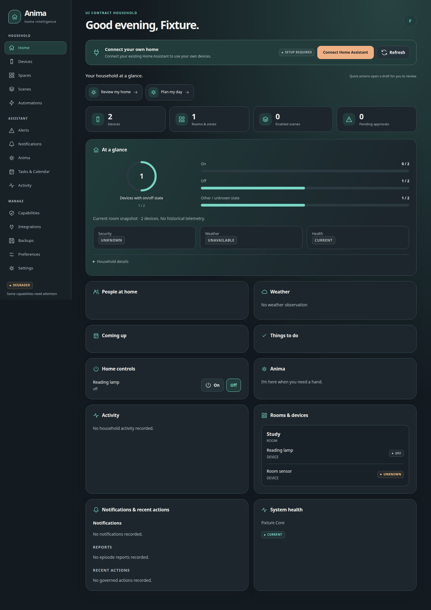
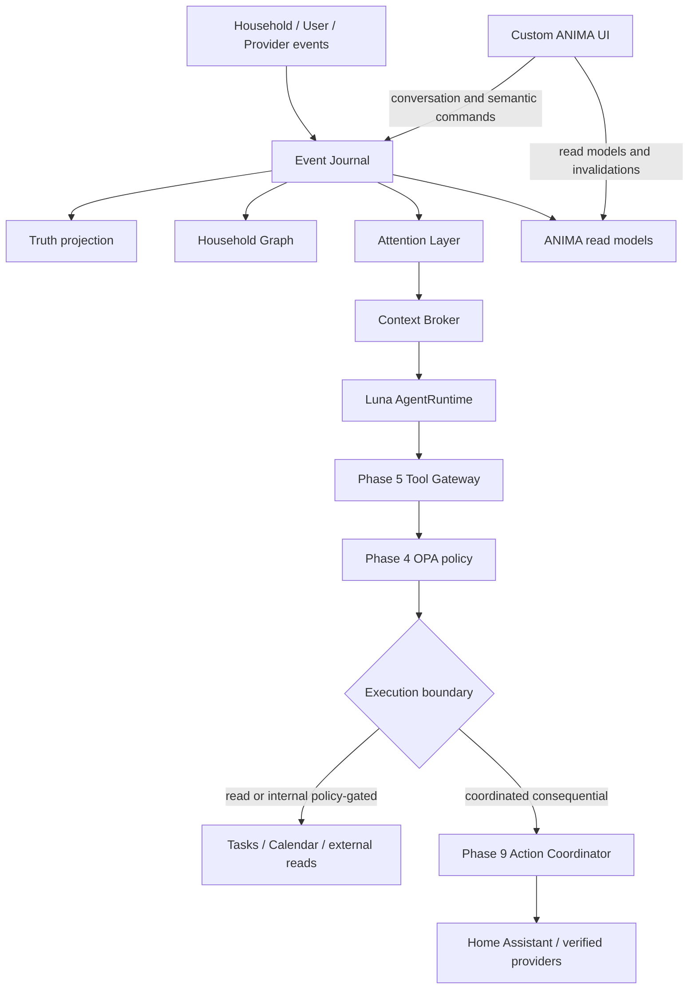
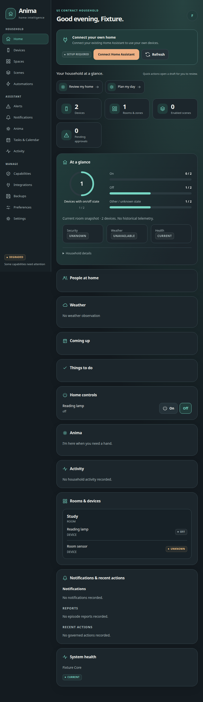
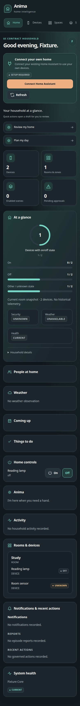

# ANIMA HA

ANIMA HA is the local-first household control plane for a connected Home Assistant installation. It keeps the event journal, Truth, household graph, policy, verified actions, durable tasks, external providers, and user-facing control surface in one authority boundary. SENTRY is the user-facing intelligence and voice layer; it reasons through ANIMA and never reaches Home Assistant directly.



## Why ANIMA is different

ANIMA treats cognition as a governed loop rather than a chat box. User and provider events enter an append-only journal, Attention decides whether reasoning is warranted, the Context Broker assembles a sparse provenance-rich packet, and Luna runs one bounded episode. Every mutation crosses the Tool Gateway and OPA policy boundary. Consequential household actions additionally use latest-state preconditions, PostgreSQL coordination, idempotency, and observed verification.

This separation makes the important claims inspectable: an LLM proposal is not authorization, an external result is not Truth, and a connector acknowledgement is not physical success.

## Architecture



The interface is a client of Core, not a second agent or direct provider console. SENTRY uses the same ANIMA Core boundary: HA events become Truth and Journal records, Attention creates durable intelligence requests, SENTRY claims a sparse ContextPacket, and every requested mutation returns through Phase 5 → Phase 4 → Phase 9. Direct home controls use that same path.

## ANIMA ↔ SENTRY

ANIMA is the household source of truth and execution authority. SENTRY owns conversation, voice, reasoning, and tool selection. The checked-in `integrations/sentry/anima-household` bundle exposes a client-only typed MCP surface for health, durable intelligence requests, sparse context, the request-bound semantic catalogue, governed tool invocation, and structured results. The boundary does not expose SQL, raw Home Assistant calls, secrets, arbitrary HTTP, shell, or policy editing.

Run the explicit ANIMA Attention pump with `anima-sentry-bridge`, then run the ANIMA-owned Core service and configure SENTRY to load the bundled MCP client with only its authenticated endpoint, private client-token path, and worker label. PostgreSQL, OPA, Home Assistant, and provider credentials stay inside ANIMA. HA-originated events—including the paired SenseGuard sensors—flow into ANIMA first, then into SENTRY as bounded reasoning work. SENTRY can ask ANIMA to read or change any capability that ANIMA has registered and policy permits; the terminal result is always ANIMA's observed result.

## Interface snapshots

These screenshots are captured from the tested local application with synthetic household data:






## What works today

- FastAPI/Uvicorn local interface with React, TypeScript, and Vite.
- Home Assistant OAuth boundary, exact principal mapping, hashed server sessions, CSRF/origin protection, and same-origin browser policy.
- Configured conversation composition into Attention, Context Broker, and the selected intelligence provider; task and local-calendar mutations use the Phase 5/4 policy path.
- Phase 9-coordinated semantic home controls when a commissioned Home Assistant provider is available.
- ANIMA-owned device onboarding from the local Devices view: open a bounded ZHA pairing window, refresh the commissioned HA registry, place a discovered device in an existing room, and expose only its normalized semantic capabilities. Power controls continue through the Phase 5/4/9 path.
- ANIMA-owned commissioned-device lifecycle from the same Devices view: rename a device, move it between existing rooms/zones, or retire it from ANIMA’s canonical model. These mutations preserve the Home Assistant registry and remain household-scoped, policy-gated Graph operations.
- ANIMA-owned typed SenseGuard alert policies from the Alerts view: select canonical resources, define an event type and household-local time window, choose priority/delivery, and enable or disable versioned policies without opening the Home Assistant frontend.
- Core-owned identity roles are re-resolved for every governed operation; UI preferences are allowlisted and persisted in PostgreSQL; OAuth state is browser-bound, expiring, and single-use.
- Bounded external capabilities: Open-Meteo, private SearXNG, OSM Overpass, TheMealDB, UPCitemdb, local PostgreSQL calendar, and ntfy; provider activation is composed by Core and unavailable providers are reported honestly.
- Restart-safe durable tasks, guaranteed scheduled-reasoning events, fresh due-time context, restricted external-content handling, and the SENTRY durable request/result boundary.

## Safety and trust model

Identity and policy are ANIMA-owned. Tool schemas expose intent, not secrets or arbitrary hosts. External provider content is `EXTERNAL_UNTRUSTED`; restricted product results are live-only and are not promoted to Truth, memory, tasks, or durable episode text. Physical/provider writes require latest-state refresh, policy reauthorization, idempotency, conflict coordination, and post-action observation.

## Evidence

Phases 0–14 are Architect accepted. Current work is goal-wide owner-facing
management-plane convergence, currently covering typed SenseGuard alert-policy
and commissioned-device lifecycle management. The [Authority state](.agent/CURRENT.md), [SENTRY integration
guide](docs/SENTRY-ANIMA-INTEGRATION.md), and active task packet distinguish
accepted platform contracts from the current bounded product increment. Phase 15
remains unauthorized.

## Implemented Phase 0 through Phase 11 baseline

This checkpoint provides:

- a `src/` Python package boundary for the future modular monolith;
- environment-only configuration with a committed, non-secret example;
- JSON structured application logging;
- a pinned `uv` project and lockfile;
- deterministic unit, lint, format, and type checks;
- a pgvector-ready PostgreSQL development service with a migration runner;
- a simulator framework entrypoint that reports readiness but does not process household events;
- an ANIMA-owned PostgreSQL event journal, truth observation model, deterministic reconciliation projection, failure tracking, and replay/rebuild path;
- an ANIMA-owned PostgreSQL canonical household graph with commissioned topology, recursive place traversal, aliases, provider references, Truth bindings, semantic queries, and journaled graph mutations;
- an ANIMA-owned PostgreSQL canonical memory store with provenance, lifecycle/correction/expiry/retraction, bounded precedence-aware retrieval, rebuildable local lexical indexing, and explicit degraded fallback;
- a deterministic journal-derived routine model whose outputs are inferred context rather than Truth, permissions, or automation;
- ANIMA-owned identity evidence, assurance aggregation, semantic action-risk classification, confirmation challenges, and a local OPA/Rego policy boundary with fail-closed behavior and journaled decisions;
- a single local validation command and a matching GitHub Actions workflow.
- an ANIMA-owned Home Assistant adapter that preserves provider identity, normalizes HA state/events into the Phase 1 contracts, exposes bounded semantic tools through the Phase 5 registry and Phase 4 policy gate, and verifies low-risk service actions against observed HA state.
- a deterministic PostgreSQL-backed Attention Layer with guaranteed-event handling, durable cursor/cooldown/rate/aggregation state, immutable decisions, durable reasoning triggers, sparse provenance-rich ContextPackets, ANIMA-owned trust/egress controls, and side-effect-free replay/profile comparison.
- an ANIMA-owned bounded cognition loop using isolated ephemeral Codex CLI ChatGPT OAuth turns, Luna 5.6 at medium reasoning, schema-only decisions, mandatory Phase 5/4 tool-policy routing, durable episodes, cloud-safe context projection, and explicit failure/budget outcomes;
- an ANIMA-owned deterministic action-execution coordinator with durable idempotency/effect records, non-blocking PostgreSQL canonical-resource locks, latest-state preconditions, final policy reauthorization, observed post-action verification, partial/unknown outcomes, and restart reconciliation.
- an ANIMA-owned declarative durable-task engine with one-shot, fixed-interval, and cron schedules, PostgreSQL leases and `SKIP LOCKED` claims, deterministic guaranteed due events, misfire/DST policy, idempotent creation, and restart-safe run history.
- bounded external-by-intent capability adapters for weather, web/place/product discovery, recipes, local Calendar reads/event creation, and configured notifications, with fixed-host HTTPS egress, explicit untrusted-content normalization, local request auditing, and Phase 9 verification for external writes.
- a shared locally hosted Phase 12 interface: React/TypeScript/Vite static assets served by FastAPI/Uvicorn, graph/Truth-backed semantic household view models, Home Assistant OAuth bootstrap with commissioned provider-reference identity resolution, hashed server-side sessions, CSRF/origin defenses, bounded SSE invalidations, and production Core command/conversation composition.

Direct SENTRY voice behavior remains owned by the SENTRY project. Retailer checkout/cart automation, browser/private endpoint access, Mem0, local embeddings, CEL, NATS, and policy-editing runtime APIs are not included. The Phase 6/9 integration is limited to an isolated HA test instance and low-risk virtual entities; Phase 11 uses Open-Meteo, private SearXNG, OpenStreetMap Overpass, TheMealDB, UPCitemdb, the first-party local calendar, and ntfy, and no human-delivery claim is made.

## Supported baseline

- Python: CPython 3.12.x, constrained by `pyproject.toml` and `.python-version`.
- Host architectures: Linux ARM64 and x86-64 are the supported target shapes. This checkpoint is executed on x86-64; ARM64 support is established from image/package metadata and remains subject to native Pi execution in a later evidence pass.
- Infrastructure: Docker Engine with Compose v2 and a persistent Docker volume.
- Database: PostgreSQL 16.15 through the pinned pgvector image digest in `compose.yaml`. The image is extension-ready; Phase 0 does not create vector or household tables.

## Fresh-checkout workflow

Install `uv 0.12.7` using the official installer or package distribution, then run:

```bash
uv sync --locked --dev
cp .env.example .env
uv run --locked --group dev anima-validate
docker compose up -d db
uv run --locked --group dev anima-migrate
uv run --locked --group dev anima-sim --once
docker compose down
```

On filesystem mounts that cannot create virtual-environment symlinks (including the current SFTP-mounted workspace), set `UV_PROJECT_ENVIRONMENT` to a local-disk directory for the `uv sync` and `uv run` commands. This is a host filesystem limitation, not an application dependency.

The validation command runs format, lint, type, and unit checks. The database commands use only the local `.env` file and do not require household configuration.

For the full evidence workflow, see [`docs/PHASE-0-RUNTIME-BASELINE.md`](docs/PHASE-0-RUNTIME-BASELINE.md).
For the ANIMA-owned Home Assistant pairing, discovery, commissioning, and control boundary, see [`docs/PHASE-13-HA-DEVICE-CONTROL.md`](docs/PHASE-13-HA-DEVICE-CONTROL.md).
For the Phase 1 event/truth contracts and replay boundary, see [`docs/PHASE-1-REALITY-SUBSTRATE.md`](docs/PHASE-1-REALITY-SUBSTRATE.md).
For the Phase 2 graph contracts, prior-art decisions, commissioning, and evidence boundary, see [`docs/PHASE-2-HOUSEHOLD-GRAPH.md`](docs/PHASE-2-HOUSEHOLD-GRAPH.md).
For the Phase 3 memory taxonomy, lifecycle, retrieval/index boundary, routine model, prior-art decisions, and evidence boundary, see [`docs/PHASE-3-GOVERNED-MEMORY.md`](docs/PHASE-3-GOVERNED-MEMORY.md).
For the Phase 4 identity, risk, OPA, confirmation, audit, and fail-closed boundary, see [`docs/PHASE-4-IDENTITY-POLICY.md`](docs/PHASE-4-IDENTITY-POLICY.md).
For the Phase 5 manifest, lifecycle, native/MCP runtime, capability registry, policy gate, secrets, event ingress, and failure containment, see [`docs/PHASE-5-PLUGIN-CAPABILITY-RUNTIME.md`](docs/PHASE-5-PLUGIN-CAPABILITY-RUNTIME.md).
For the Phase 6 adapter, discovery, provider mapping, synchronization, reconnect, policy-gated semantic tools, and observed-state verification, see [`docs/PHASE-6-HOME-ASSISTANT-ADAPTER.md`](docs/PHASE-6-HOME-ASSISTANT-ADAPTER.md).
For the Phase 7 attention profiles, guaranteed triggers, durable cursor/aggregation, sparse ContextPackets, trust/egress controls, and replay boundary, see [`docs/PHASE-7-ATTENTION-CONTEXT.md`](docs/PHASE-7-ATTENTION-CONTEXT.md).
For the Phase 8 Codex OAuth boundary, structured cognition loop, durable episodes, policy-gated tools, privacy controls, dependency decision, and evidence limits, see [`docs/PHASE-8-CODEX-OAUTH-AGENT-RUNTIME.md`](docs/PHASE-8-CODEX-OAUTH-AGENT-RUNTIME.md).
For the Phase 9 action lifecycle, resource conflicts, idempotency, latest-state preconditions, policy reauthorization, verification, partial/unknown outcomes, restart reconciliation, and evidence limits, see [`docs/PHASE-9-ACTION-EXECUTION-CONCURRENCY.md`](docs/PHASE-9-ACTION-EXECUTION-CONCURRENCY.md).
For the Phase 10 declarative durable-task model, scheduling, misfire/DST policy, leases, deterministic due events, task safety boundary, dependency decisions, and evidence limits, see [`docs/PHASE-10-DURABLE-TASK-ENGINE.md`](docs/PHASE-10-DURABLE-TASK-ENGINE.md).
For the Phase 11 external-by-intent adapters, fixed-host egress, trust/audit boundary, provider gates, Calendar/notification write verification, and evidence limits, see [`docs/PHASE-11-EXTERNAL-CAPABILITIES.md`](docs/PHASE-11-EXTERNAL-CAPABILITIES.md).
For the Phase 12 custom local interface, OAuth/session boundary, semantic API, SSE invalidation, UI privacy posture, and validation limits, see [`docs/PHASE-12-CUSTOM-LOCAL-INTERFACE.md`](docs/PHASE-12-CUSTOM-LOCAL-INTERFACE.md).

## Authority

The current owner-facing increment is documented in [GOAL-ALERT-POLICY-MANAGEMENT-017A.md](docs/GOAL-ALERT-POLICY-MANAGEMENT-017A.md).

The adopted goal and operating workflow live in [`PROJECT_GOAL.md`](.agent/PROJECT_GOAL.md), [`AGENTS.md`](AGENTS.md), and `.agents/`. Product implementation remains bounded by the Authority records in `.agent/`.
