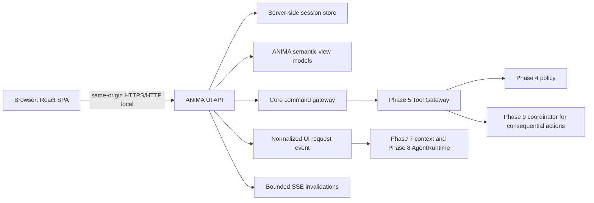

# Phase 12 — Custom Whole-Home Interface

Status: implementation checkpoint `8a8f798d5d2319e690572d69a323e10459924bce`, hosted CI `33572829176` passed; governed evidence closure and Architect acceptance pending.

Phase 11 is Architect accepted at `918365ce7c6145780112a808411d750fb0e289eb` with
hosted CI `33562645002`. Phase 13 voice behavior is not implemented.

## Architecture

The browser receives only API view models. It does not receive Home Assistant
credentials, database connections, OPA details, provider keys, raw journal
payloads, raw ContextPackets, or arbitrary tool invocation access. Browser
mutations require a server session, a session-bound CSRF token, and a matching
Origin. Production command handling is fail-closed until the host injects the
existing Core gateway; the UI layer never calls TaskService, CalendarService,
Home Assistant, or SQL as a policy bypass.

## Stack qualification

| Layer | Adopted version | Role | License/source |
| --- | --- | --- | --- |
| FastAPI | 0.141.1 | local Python API | MIT; https://fastapi.tiangolo.com/ |
| Uvicorn | 0.52.4 | ASGI server | BSD-3-Clause; https://www.uvicorn.org/ |
| React / React DOM | 19.2.8 | shared SPA | MIT; https://react.dev/ |
| Vite | 8.2.2 | build-time bundler | MIT; https://vite.dev/ |
| TypeScript | 7.0.2 | static checking | Apache-2.0; https://www.typescriptlang.org/ |
| `@vitejs/plugin-react` | 6.1.1 | Vite React transform | MIT; https://github.com/vitejs/vite-plugin-react |
| Node | 24.20.0 | build-only runtime | https://nodejs.org/ |
| Playwright | 1.62.1 | development/browser evidence | Apache-2.0; https://playwright.dev/ |

Node is used only to build `ui/dist`; the Python image serves the result and
does not run a Node daemon. The container builder and runtime base images are
immutable digest references in `Dockerfile.ui`.

## Identity and session

The supported Home Assistant OAuth contract is authorization-code based:
`/auth/authorize` returns a code, `/auth/token` exchanges it, and the temporary
bearer is used to authenticate a WebSocket `auth/current_user` lookup. ANIMA
maps the exact HA user ID to a commissioned `(household_id, principal_id)`;
display-name matching is not allowed. The bearer is scoped to the callback
coroutine and is not returned to the browser or stored in ANIMA.

The local session is a high-entropy `HttpOnly`, `SameSite=Strict` cookie. The
server stores only SHA-256 digests of the cookie secret and CSRF material in
`anima_ui_sessions` (migration `0013_ui_sessions.sql`). Sessions have an
8-hour absolute and 30-minute idle lifetime. HA owner/admin flags are provider
metadata, not ANIMA authority; the session emits normal
`AUTHENTICATED_SESSION` evidence and does not imply strong authentication.

The deterministic test auth path is enabled only by `ANIMA_UI_TEST_AUTH=1` and
maps the fixed test user. An unmapped HA user fails closed with
`PRINCIPAL_MAPPING_REQUIRED`.

## API contract

| Route | Purpose | Boundary |
| --- | --- | --- |
| `GET /healthz` | data-free health | unauthenticated |
| `GET /auth/login` / callback | HA OAuth bootstrap or test fixture | no bearer returned |
| `GET /api/v1/bootstrap` | identity display, config, capability summary | session |
| `GET /api/v1/home` | household semantic snapshot | session, `no-store` |
| `GET /api/v1/tasks` | household-scoped task projection | session |
| `POST /api/v1/tasks...` | task mutations | session + CSRF + Core gateway |
| `GET /api/v1/calendar` | local calendar projection | session |
| `POST /api/v1/calendar` | calendar mutation | session + CSRF + Core gateway |
| `GET /api/v1/activity` | bounded sanitized activity | session |
| `GET /api/v1/capabilities` | availability/health projection | session |
| `POST /api/v1/conversation` | normalized direct-user request ingress | session + CSRF + injected journal/attention/context/AgentRuntime bridge |
| `POST /api/v1/controls/{id}` | semantic low-risk control ingress | session + CSRF + Phase 5/4/9 bridge |
| `GET /api/v1/events` | invalidation-only SSE | session |

Dynamic responses carry `Cache-Control: no-store`. SSE sends only safe event
names; the browser refetches a semantic snapshot. A slow subscriber is bounded
to 64 invalidations and is collapsed to `refresh.required`.

## Privacy and UI configuration

The SPA has one shared component system for desktop, tablet/wall, and phone
layouts. Theme, density, visibility, display mode, and accessibility are
configuration values selecting known components; no executable HTML, CSS,
JavaScript, or remote URL can be supplied by household configuration.

There is no service worker, localStorage, IndexedDB, Cache API, analytics,
third-party font/CDN, or browser-side conversation/provider cache. CSP limits
scripts, images, connections, and fonts to same-origin sources. The default
UI renders restricted provider content only when supplied by a current live
response; this frontend does not persist it.

The default visual language is a dark, warm, quiet household surface with
semantic cards rather than an entity grid. Unsupported voice is displayed as
unavailable/future state only; no microphone, wake word, STT, or TTS behavior
is present.

## Validation boundary

Deterministic backend tests cover health/auth, single-use OAuth state, exact
principal mapping, hashed sessions, expiry/revocation, CSRF/Origin, semantic
view-model projection, journaled request provenance, and fail-closed commands.
The default production service refuses conversation execution until the host
injects the existing Core conversation bridge; the echo response is test-only
and is not evidence that a model episode ran.
Frontend checks cover TypeScript, no client persistence/remote dependencies,
and production Vite output. Playwright covers login, dashboard, conversation,
desktop/tablet/phone viewports, same-origin network posture, and reload.

Evidence remains local/x86 unless separately marked: no native Raspberry Pi
run, public deployment, production TLS, real household data, or Phase 13 voice
qualification is claimed.
