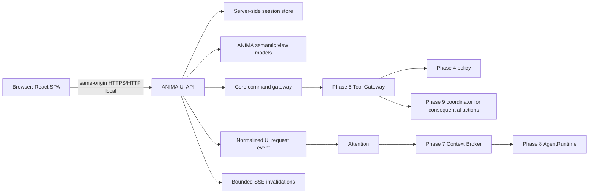

# Phase 12 — Custom Whole-Home Interface

Status: `CONTINUE — H5 EVIDENCE CLOSURE INCOMPLETE; PENDING ARCHITECT ACCEPTANCE`.

H5 current checkpoint: `800d8cf4a183ce0e7548545182ed09f0687ad98f`; hosted CI
`33696481738` passed on that exact SHA. The hosted job published artifact
`9872060277` (`phase12-h5-evidence-800d8cf4a183ce0e7548545182ed09f0687ad98f`)
with ZIP digest `33e32d1966462416f27b1fec109cfac7097de2d15dac0f5e8086a580ce31a383`.

H5 adds measurable display-mode layout behavior, deterministic PostgreSQL/OPA/Core
external audit and health evidence, restricted-content PostgreSQL scanning, and
same-session reconstruction at the API/Core level. The current hosted Playwright
matrix passes 11 tests and skips 10 responsive/functional cases. Browser-visible
OPA denial, provider degradation/recovery, restricted-content reload/storage,
same-browser process restart/SSE recovery, and browser-visible isolated-HA
outcomes remain `NOT RUN` acceptance evidence. Phase 12 remains `CONTINUE`; this
document does not promote it to Architect accepted.

The latest governance/CI reliability checkpoint is `828230a73d3c9097bab448192747a3f6786c0d4f`; hosted CI `33697593173` passed on that exact SHA. Its bounded workflow fix waits for healthy PostgreSQL/OPA containers before migration. This does not promote the unrun browser journeys to completed evidence.

H4 implementation head: `9e12f6e295b52ec382c1952a21a1a95287100740`; hosted CI
`33686351783` passed on that exact SHA. The later governance checkpoint is
recorded in the final Authority/Notion readback.

Prior commissioned-runtime implementation checkpoint: `5d52c45c72520611de56361af9010419f2869c6c`; hosted CI `33654654675` passed on that exact SHA.
Prior governed closure checkpoint: `bc7849dba3b65b837aacf2b16e8b7653fae97d08`; hosted CI `33655337251` passed on that exact SHA.

Final UX/authority implementation checkpoint: `37116b03c65bfac54a5261f30160e9030aa6011c`; hosted CI `33671817841` passed on that exact SHA. The final governed checkpoint is the commit containing this closure record; its exact SHA and CI are recorded in the final Notion readback.

## H4 verified UX/E2E closure

Home controls now send the qualified `desired_on` semantic field while Core
adds the canonical resource reference. `CoreUICommandGateway` returns the
Phase 9 terminal action record, not connector acknowledgement; the browser
publishes normalized success, failure, unknown, denial, confirmation, and
strong-auth outcomes after the matching Core refetch. Calendar edits carry
the projected optimistic version, and the browser applies appearance, layout,
widget visibility/order, density, text scale, accent, and reduced-motion
preferences.

The H4 Core target uses real PostgreSQL, OPA, graph/Truth, journal, Attention,
Context Broker, AgentRuntime, PluginManager, task, calendar, and action
composition with only the model adapter scripted. The reused Phase 6 harness
also proves the UI-originated control path through Phase 5, OPA, Phase 9, and
isolated Home Assistant, including a deliberate post-action verification
mismatch. The browser matrix passes the real conversation, task lifecycle,
calendar edit/cancel, settings persistence, and responsive smoke paths. The
current evidence packet explicitly identifies browser-specific denial,
degraded-provider, restricted-content reload, restart/SSE, and isolated-HA
browser journeys that were not independently run.

Phase 11 is Architect accepted at `918365ce7c6145780112a808411d750fb0e289eb` with
hosted CI `33562645002`. Phase 13 voice behavior is not implemented.

## Commissioned-runtime truth closure

`create_app()` constructs the PostgreSQL Core composition whenever
`ANIMA_DATABASE_URL` is present. Core registers the accepted task and local
calendar tools plus the qualified Phase 11 portfolio: Open-Meteo, private
SearXNG/Overpass discovery, UPCitemdb, TheMealDB, and optionally ntfy when its
topic is configured. Walmart and Best Buy are not active providers.

HA identity is resolved from commissioned `home_assistant` provider references
targeting a canonical `PERSON`, then a single `MEMBER_OF` household edge.
Missing mappings fail closed with `PRINCIPAL_MAPPING_REQUIRED`; multiple
targets or household edges fail closed with `PRINCIPAL_MAPPING_CONFLICT`.
Normal startup never creates the fixed test mapping. It is available only with
the explicit `ANIMA_UI_TEST_AUTH=1` test flag.

Home bootstrap, household state, presence, controls, and capability views are
derived from the commissioned graph, Truth projection, and Core plugin
registry. Missing dependencies produce neutral `UNKNOWN`/`UNAVAILABLE` state;
they do not select demo household data.

The real local target is reproducible with:

```bash
ANIMA_DATABASE_URL=postgresql://... \
ANIMA_OPA_URL=http://127.0.0.1:18181 \
uv run python scripts/verify_phase12_commissioned_runtime.py
```

It uses PostgreSQL graph/journal/attention/context/episode stores and the live
OPA server. Only the model response is scripted. It verifies exact
commissioned identity mapping, policy-gated task/calendar mutation, the
Journal → Attention → ContextPacket → AgentRuntime trace, and the active
provider registry. Real HA OAuth, household data, and physical-home behavior
remain operator commissioning evidence rather than claims of this fixture.

## Architecture



The browser receives only API view models. It does not receive Home Assistant
credentials, database connections, OPA details, provider keys, raw journal
payloads, raw ContextPackets, or arbitrary tool invocation access. Browser
mutations require a server session, a session-bound CSRF token, and a matching
Origin. The normal configured service composes the existing Core journal,
Attention, Context Broker, AgentRuntime, PluginManager, policy client, task
service, and calendar service through `src/anima_ha/ui_runtime.py`. The UI
layer never calls TaskService, CalendarService, Home Assistant, or SQL as a
policy bypass. A missing configured dependency produces an explicit
unavailable capability; the test-only echo remains behind
`ANIMA_UI_TEST_AUTH=1`.

## Final UX/authority convergence

The current hardening keeps authority in Core at every browser boundary. The
configured UI resolves the authenticated principal's semantic role from the
commissioned graph for each command and conversation, and fails closed when
that role is absent. Task and local-calendar mutations are policy-gated
internal tools; home controls remain Phase 5 → Phase 4 → Phase 9 coordinated
actions. No browser payload can provide role, provenance, provider identity, or
execution authority.

HA OAuth state is bound to the initiating browser by an expiring, single-use
nonce cookie. Capability status is derived independently from plugin health and
external-audit state, so degraded providers are not reported as online. UI
preferences use migration `0014_ui_preferences.sql`, an allowlisted PostgreSQL
store, CSRF/Origin-protected settings routes, and client-side application with
no persistent browser storage. Calendar list projections include their
optimistic-concurrency version.

## Stack qualification

| Layer | Adopted version | Role | License/source |
| --- | --- | --- | --- |
| FastAPI | 0.141.1 | local Python API | MIT; https://fastapi.tiangolo.com/ |
| Uvicorn | 0.52.4 | ASGI server | BSD-3-Clause; https://www.uvicorn.org/ |
| React / React DOM | 19.2.8 | shared SPA | MIT; https://react.dev/ |
| Vite | 8.2.2 | build-time bundler | MIT; https://vite.dev/ |
| TypeScript | 7.0.2 | static checking | Apache-2.0; https://www.typescriptlang.org/ |
| `@vitejs/plugin-react` | 6.1.1 | Vite React transform | MIT; https://github.com/vitejs/vite-plugin-react |
| Node | 24.20.0 | build-only runtime | https://nodejs.org/ |
| Playwright | 1.62.1 | development/browser evidence | Apache-2.0; https://playwright.dev/ |

Node is used only to build `ui/dist`; the Python image serves the result and
does not run a Node daemon. The container builder and runtime base images are
immutable digest references in `Dockerfile.ui`.

## Identity and session

The supported Home Assistant OAuth contract is authorization-code based:
`/auth/authorize` returns a code, `/auth/token` exchanges it, and the temporary
bearer is used to authenticate a WebSocket `auth/current_user` lookup. ANIMA
maps the exact HA user ID to a commissioned `(household_id, principal_id)`;
display-name matching is not allowed. The bearer is scoped to the callback
coroutine and is not returned to the browser or stored in ANIMA.

The local session is a high-entropy `HttpOnly`, `SameSite=Strict` cookie. The
server stores only SHA-256 digests of the cookie secret and CSRF material in
`anima_ui_sessions` (migration `0013_ui_sessions.sql`). Sessions have an
8-hour absolute and 30-minute idle lifetime. HA owner/admin flags are provider
metadata, not ANIMA authority; the session emits normal
`AUTHENTICATED_SESSION` evidence and does not imply strong authentication.

The deterministic test auth path is enabled only by `ANIMA_UI_TEST_AUTH=1` and
maps the fixed test user. An unmapped HA user fails closed with
`PRINCIPAL_MAPPING_REQUIRED`.

## API contract

| Route | Purpose | Boundary |
| --- | --- | --- |
| `GET /healthz` | data-free health | unauthenticated |
| `GET /auth/login` / callback | HA OAuth bootstrap or test fixture | no bearer returned |
| `GET /api/v1/bootstrap` | identity display, config, capability summary | session |
| `GET /api/v1/home` | household semantic snapshot | session, `no-store` |
| `GET /api/v1/tasks` | household-scoped task projection | session |
| `POST /api/v1/tasks...` | task mutations | session + CSRF + Core gateway |
| `GET /api/v1/calendar` | local calendar projection | session |
| `POST /api/v1/calendar` | calendar create mutation | session + CSRF + Core gateway |
| `POST /api/v1/calendar/{event_id}/{operation}` | calendar update/cancel mutation | session + CSRF + Core gateway + expected version |
| `GET /api/v1/settings` / `PUT /api/v1/settings` | allowlisted presentation preferences | session / session + CSRF + Origin |
| `GET /api/v1/activity` | bounded sanitized activity | session |
| `GET /api/v1/capabilities` | availability/health projection | session |
| `POST /api/v1/conversation` | normalized direct-user request ingress | session + CSRF + journal → attention → context → AgentRuntime |
| `POST /api/v1/controls/{id}` | semantic low-risk control ingress | session + CSRF + Phase 5/4/9 bridge |
| `GET /api/v1/events` | invalidation-only SSE | session |

Dynamic responses carry `Cache-Control: no-store`. SSE sends only safe event
names; the browser refetches a semantic snapshot. A slow subscriber is bounded
to 64 invalidations and is collapsed to `refresh.required`.

## Privacy and UI configuration

The SPA has one shared component system for desktop, tablet/wall, and phone
layouts. Theme, density, visibility, display mode, and accessibility are
configuration values selecting known components; no executable HTML, CSS,
JavaScript, or remote URL can be supplied by household configuration.

There is no service worker, localStorage, IndexedDB, Cache API, analytics,
third-party font/CDN, or browser-side conversation/provider cache. CSP limits
scripts, images, connections, and fonts to same-origin sources. The default
UI renders restricted provider content only when supplied by a current live
response; this frontend does not persist it.

The default visual language is a dark, warm, quiet household surface with
semantic cards rather than an entity grid. Unsupported voice is displayed as
unavailable/future state only; no microphone, wake word, STT, or TTS behavior
is present.

## Validation boundary

Deterministic backend tests cover health/auth, browser-bound single-use OAuth
state, exact principal/role mapping, hashed sessions, expiry/revocation,
CSRF/Origin, semantic view-model projection, journaled request provenance,
allowlisted settings persistence, and Core-routed commands.
The integrated composition test exercises the real AgentRuntime from an event
trigger; the echo response is test-only and is not used by the normal
configured path.
Frontend checks cover TypeScript, no client persistence/remote dependencies,
and production Vite output. Playwright covers login, dashboard, conversation,
desktop/tablet/phone viewports, same-origin network posture, and reload.

Evidence remains local/x86 unless separately marked: no native Raspberry Pi
run, public deployment, production TLS, real household data, or Phase 13 voice
qualification is claimed.

## Visual evidence

The responsive interface was captured from the running application with the
explicit synthetic test-auth flag and non-sensitive demo data:

- `docs/assets/anima-home-desktop.png`
- `docs/assets/anima-home-tablet.png`
- `docs/assets/anima-home-phone.png`
