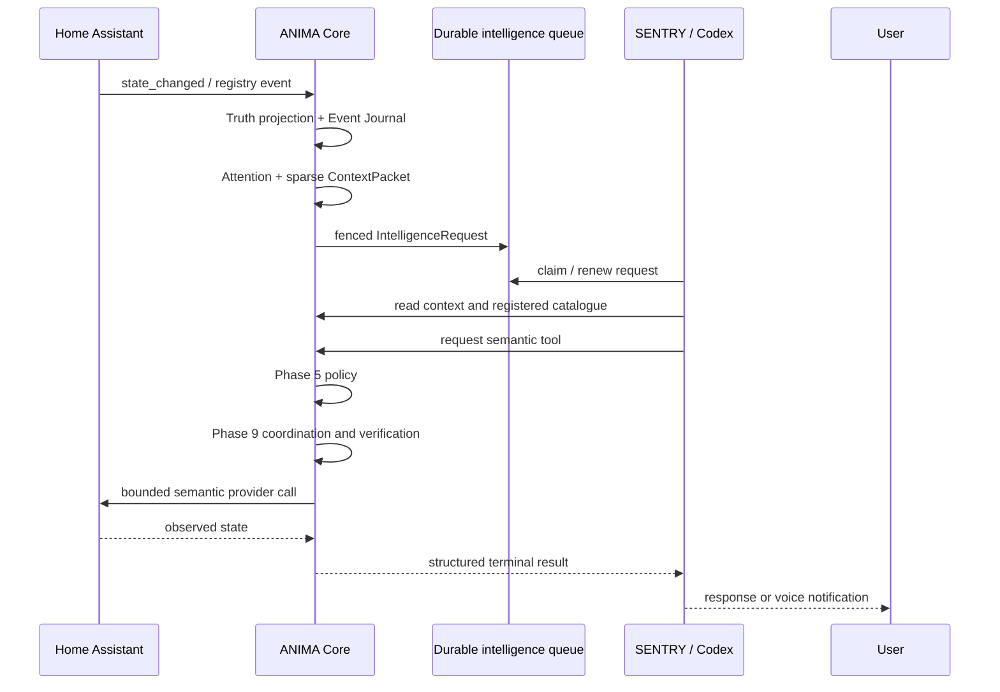

# SENTRY ↔ ANIMA integration

ANIMA is the whole-home control plane. SENTRY is the single production
intelligence and voice provider. Home Assistant remains an underlying
provider, not a second user interface that SENTRY calls directly.

## Runtime flow



## Ownership

- ANIMA owns identity, household scope, Truth, Journal, Graph, Attention,
  context selection, policy, tool registration, secrets, Home Assistant
  access, action coordination, verification, durable tasks, and audit.
- SENTRY owns interaction, persona, reasoning, planning, and tool choice.
- SENTRY cannot mint authority, alter policy, write raw SQL, call raw HA
  services, select a provider host, or turn connector acknowledgement into
  physical success.

## Local setup

Apply migrations, then set non-secret configuration in the host environment:

```bash
export ANIMA_DATABASE_URL='postgresql://...'
export ANIMA_OPA_URL='http://127.0.0.1:8181'
export ANIMA_HOUSEHOLD_ID='<commissioned-household-uuid>'
export ANIMA_HA_WEBSOCKET_URL='ws://127.0.0.1:8123/api/websocket'
export ANIMA_HA_INSTANCE_ID='<commissioned-instance-uuid>'
export ANIMA_HA_PROVIDER_SCOPE='<commissioned-instance-uuid>'
export ANIMA_HA_TOKEN_SECRET_NAME='HA_ACCESS_TOKEN'
export ANIMA_SENTRY_WORKER_ID='sentry-atlas-desktop'
```

The HA token value is supplied to ANIMA's existing secret broker; it is not
placed in this document, the SENTRY prompt, a ContextPacket, or the Git
repository.

Start the ANIMA-owned Core service and Attention pump as separate processes:

```bash
umask 077
export ANIMA_SENTRY_SERVICE_TOKEN_FILE=/run/anima/sentry-client.token
anima-core-service --socket /run/anima/core.sock \
  --token-file "$ANIMA_SENTRY_SERVICE_TOKEN_FILE"
anima-sentry-bridge
```

The token file is a short-lived/revocable service credential created by the
operator inside ANIMA's service boundary. It is not a Home Assistant token,
database URL, OPA URL, or provider credential. The checked-in
`integrations/sentry/anima-household/.mcp.json` gives SENTRY only the Core
socket/loopback endpoint, private client-token path, and a worker label.

Load that bundled MCP client in SENTRY. SENTRY should claim a request,
read the exact sparse context, select from the returned catalogue, invoke
semantic tools, and submit a bounded `RESPONSE`, `NO_ACTION`,
`TOOL_ACTIVITY_COMPLETED`, `WAITING_CONFIRMATION`, `WAITING_STRONGER_AUTH`,
`PARTIAL`, `FAILED`, `UNAVAILABLE`, or `UNKNOWN_RESULT` result.

## SenseGuard behavior

The paired `SenseGuard Kitchen` and `SenseGuard Basement` devices are already
represented by Home Assistant's ZHA integration. Their `state_changed` events
are normalized by ANIMA into Truth observations and Journal records. The
typed SenseGuard alert policy is the ANIMA-owned place to define resource,
event, household-local time window, priority, guaranteed attention, delivery
mode, and provenance. The Attention pump then creates durable SENTRY work
from matching records. A follow-up question re-enters ANIMA's semantic read
path and does not query HA directly.

## ANIMA device onboarding

The ANIMA UI is also the supported operator surface for adding commissioned
Home Assistant devices. Its Devices view opens a bounded ZHA pairing window,
refreshes the HA registry, and lets an authenticated household principal
assign a discovered device to an existing ANIMA room. The built-in HA plugin
derives canonical resources, capabilities, provider references, and Truth
bindings from the registry. It does not expose arbitrary HA services or raw
configuration to SENTRY, Luna, or the browser. Newly commissioned power
capabilities appear in Home and retain the normal Phase 5 -> Phase 4 -> Phase
9 verified-control path. See
[`PHASE-13-HA-DEVICE-CONTROL.md`](PHASE-13-HA-DEVICE-CONTROL.md).

## Boundaries and current evidence

The implementation is intentionally split into a durable queue, an ANIMA-owned
Core service, a client-only MCP transport, and an explicit Attention pump.
The service owns PostgreSQL, OPA, Home Assistant, and provider credentials;
the SENTRY-side package cannot import the ANIMA checkout. Requests persist the
exact catalogue bound at creation, and an expired provider-running lease is
terminalized as ambiguous instead of being blindly replayed. Existing HA,
policy, action, task, calendar, provider, and UI tests remain the regression
boundary. Host-level SENTRY installation and any real voice broadcast still
require commissioning and must not be inferred from deterministic unit tests.

## R2 boundary additions

The Core service now exposes two distinct intake contracts. Autonomous work is
claimed from the SENTRY queue, while `POST /v1/interactions/direct` creates a
new `DIRECT_SENTRY_INTERACTION` and claims that exact request. A direct request
contains only sparse server-built context; it does not consume an Attention
request.

Every client turn must call `POST /v1/requests/{request_id}/provider-start`
after loading context and the request-bound catalogue, and before invoking
Codex/Luna. Once that transition succeeds, expiry is potentially executed
provider work and is not safe for blind replay.

The ANIMA service registers SENTRY as a server-owned service principal bound to
one configured household and the `sentry` provider. The client cannot choose a
household, role, assurance, or provider. SENTRY identity observations are
translated into short-lived `RECOGNIZED` evidence only; unknown, ambiguous, or
expired observations cannot name a principal or authenticate a request.

## R3 integration qualification

Direct interaction identity is scoped to the registered SENTRY client and
household, and direct observations are stored as ANIMA `IdentityEvidence`
before the request is created. The request carries the real persisted evidence
ID and a bounded aggregated context; SENTRY recognition remains evidence only.

Incoming non-snapshot Home Assistant state events are passed to the typed
SenseGuard router. It resolves the canonical resource, applies the configured
household-local event/time-window policy, appends one deterministic guaranteed
attention event, and hands it to the existing SENTRY Attention bridge.
Unrelated event types are rejected and repeated delivery is deduplicated.

R3 local evidence is deterministic and regression-protected. The protected
dirty SENTRY V0.4 host was not modified, and live/shadow SENTRY, physical
SenseGuard, and voice evidence remain explicitly unclaimed until commissioning
is available.
