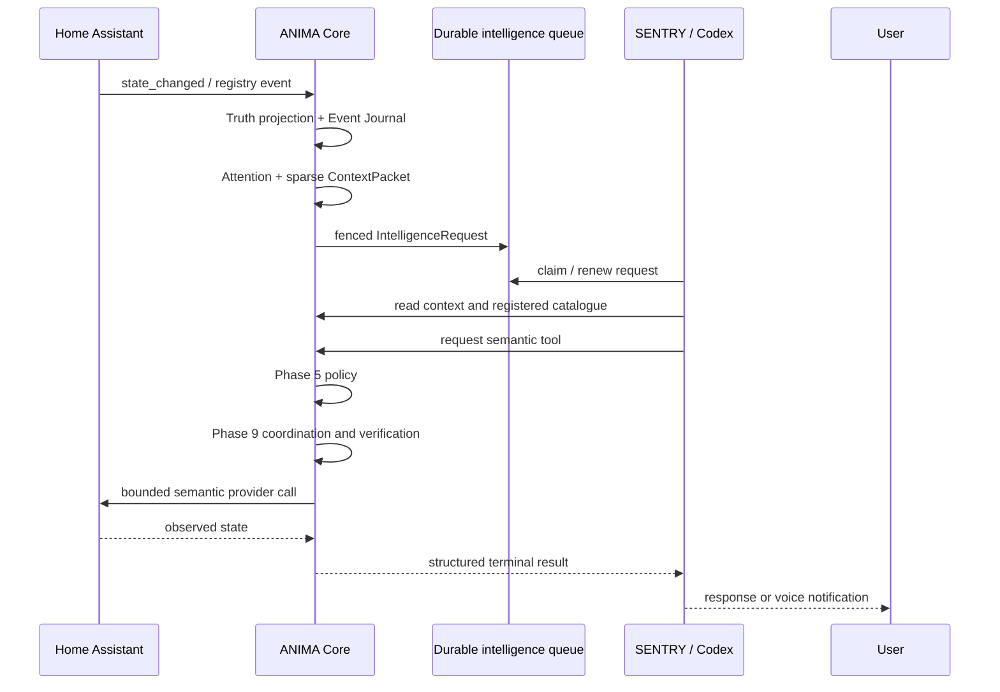

# SENTRY ↔ ANIMA integration

ANIMA is the whole-home control plane. SENTRY is the single production
intelligence and voice provider. Home Assistant remains an underlying
provider, not a second user interface that SENTRY calls directly.

## Runtime flow



## Ownership

- ANIMA owns identity, household scope, Truth, Journal, Graph, Attention,
  context selection, policy, tool registration, secrets, Home Assistant
  access, action coordination, verification, durable tasks, and audit.
- SENTRY owns interaction, persona, reasoning, planning, and tool choice.
- SENTRY cannot mint authority, alter policy, write raw SQL, call raw HA
  services, select a provider host, or turn connector acknowledgement into
  physical success.

## Local setup

Apply migrations, then set non-secret configuration in the host environment:

```bash
export ANIMA_DATABASE_URL='postgresql://...'
export ANIMA_OPA_URL='http://127.0.0.1:8181'
export ANIMA_HOUSEHOLD_ID='<commissioned-household-uuid>'
export ANIMA_HA_WEBSOCKET_URL='ws://127.0.0.1:8123/api/websocket'
export ANIMA_HA_INSTANCE_ID='<commissioned-instance-uuid>'
export ANIMA_HA_PROVIDER_SCOPE='<commissioned-instance-uuid>'
export ANIMA_HA_TOKEN_SECRET_NAME='HA_ACCESS_TOKEN'
export ANIMA_SENTRY_WORKER_ID='sentry-atlas-desktop'
```

The HA token value is supplied to ANIMA's existing secret broker; it is not
placed in this document, the SENTRY prompt, a ContextPacket, or the Git
repository.

Start the two explicit processes:

```bash
anima-sentry-bridge
ANIMA_DATABASE_URL="$ANIMA_DATABASE_URL" \
ANIMA_SENTRY_WORKER_ID="$ANIMA_SENTRY_WORKER_ID" \
  integrations/sentry/anima-core/scripts/launch_anima_core_mcp
```

Load the bundled MCP server in SENTRY using the checked-in
`integrations/sentry/anima-core/.mcp.json`. SENTRY should claim a request,
read the exact sparse context, select from the returned catalogue, invoke
semantic tools, and submit a bounded `RESPONSE`, `NO_ACTION`,
`TOOL_ACTIVITY_COMPLETED`, `WAITING_CONFIRMATION`, `WAITING_STRONGER_AUTH`,
`PARTIAL`, `FAILED`, `UNAVAILABLE`, or `UNKNOWN_RESULT` result.

## SenseGuard behavior

The paired `SenseGuard Kitchen` and `SenseGuard Basement` devices are already
represented by Home Assistant's ZHA integration. Their `state_changed` events
are normalized by ANIMA into Truth observations and Journal records. The
Attention pump creates durable SENTRY work from those records. SENTRY can then
compare the event and current state with the household's persisted preferences
and return a notification decision. A follow-up question re-enters ANIMA's
semantic read path and does not query HA directly.

## Boundaries and current evidence

The implementation is intentionally split into a durable queue, a Core-owned
boundary, an MCP transport, and an explicit Attention pump. Existing HA,
policy, action, task, calendar, provider, and UI tests remain the regression
boundary. Host-level SENTRY installation and any real voice broadcast still
require commissioning and must not be inferred from deterministic unit tests.
